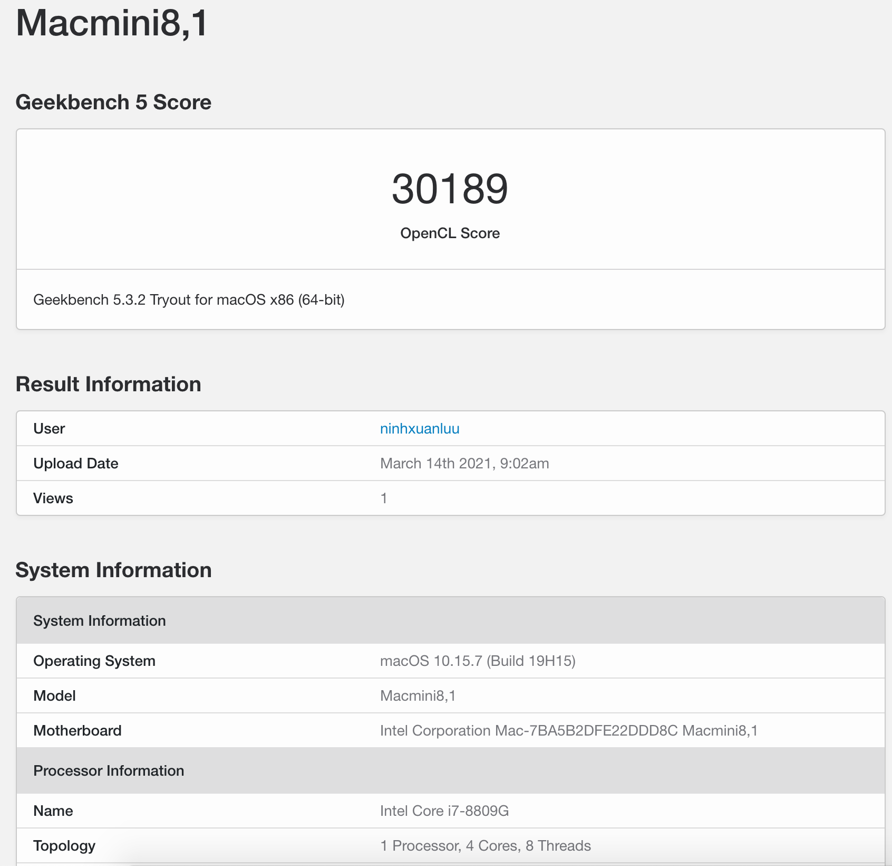

# nuc8i7hvk-opencore-efi
OpenCore EFI for Intel NUC KIT(nuc8i7hvk) on MacOS Catalina

## Hardware

* [Intel® NUC Kit NUC8i7HVK](https://www.intel.com/content/www/us/en/products/boards-kits/nuc/kits/nuc8i7hvk.html)
* CPU: Intel® Core™ i7-8809G
* GPU: AMD Radeon RX Vega M GH 4GB
* RAM: HyperX Impact DDR4 32GB (2 x 16GB) 2667Mhz
* SSD: Samsung 970 EVO Plus PCIe NVMe V-NAND M.2 2280 500GB(for MacOS)
* SSD: Samsung 960 Pro PCIe NVME 512GB(for Windows)
* DW1560 Card - Broadcom BCM94352Z 802.11ac 867Mpbs

## Software

* Bootloader: OpenCore 0.6.6 + reEFInd
* OS: macOS Catalina 10.15.7

## Benchmark

CPU

GPU

Cinebench

TPD

Result

## Dual boot

